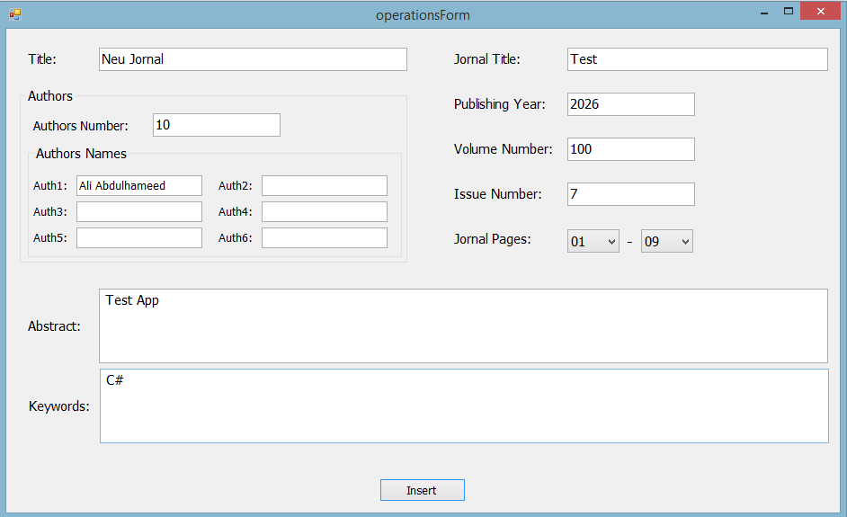
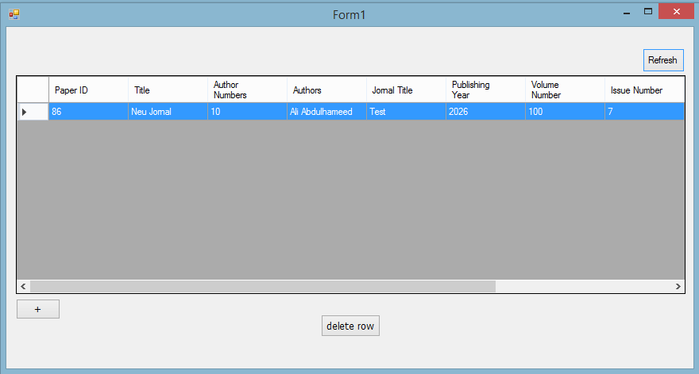
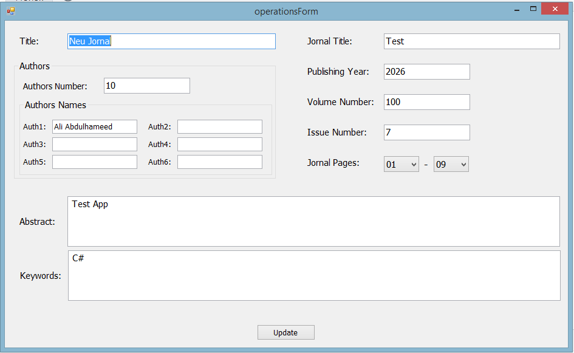

# C_Sharp-paper-indexing
master-Aufgabe-C#-application

##  Projektbeschreibung
Diese C#-Desktop-Anwendung wurde im Rahmen akademischer Projekte entwickelt
und implementiert alle grundlegenden CRUD-Funktionalitäten
(Create, Read, Update, Delete).

Die Anwendung verfügt über eine grafische Benutzeroberfläche (GUI)
und ermöglicht Benutzerverwaltung sowie Datenbearbeitung.

---

##  Screenshots

### Datensatz hinzufügen
Diese Abbildung zeigt das Hinzufügen eines neuen Datensatzes.

---

### Data im Dtabase und die Löchenfunktion
Diese Abbildung zeigt die geschpeichrten Data.

---

### Bearbeitung
Diese Abbildung zeigt die Bearbeitungsfunktion.

---

### Autor
Ali Adulhameed /2017
